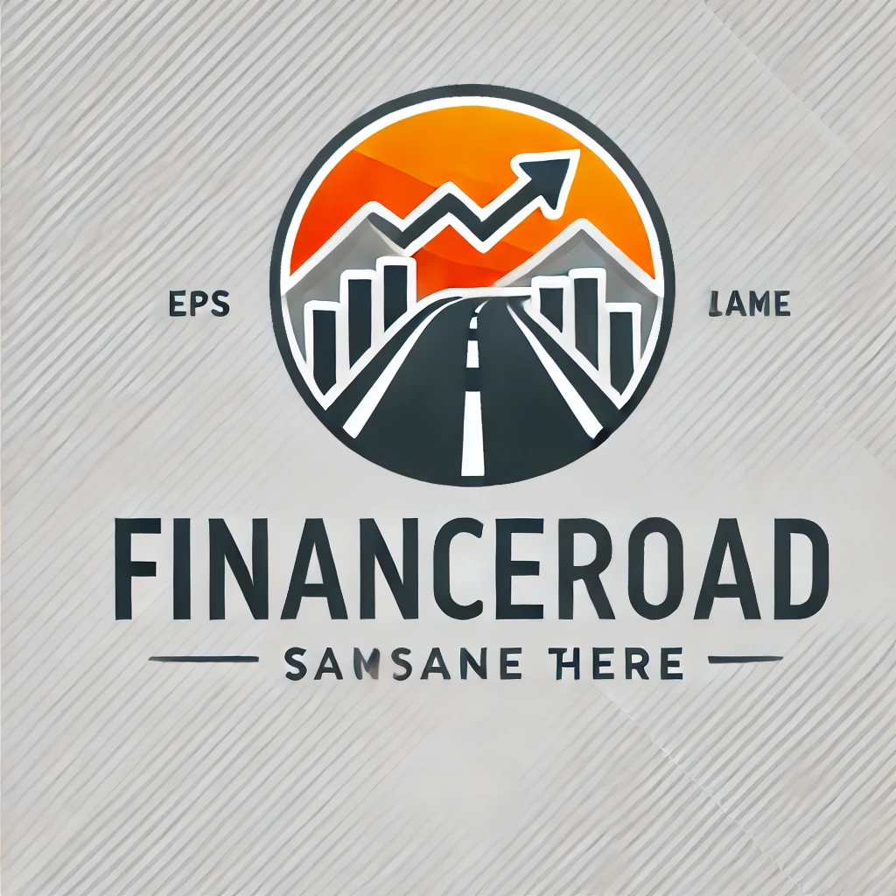

<link rel="stylesheet" href="style.css">

<header>
    
    <h1 style="display: inline-block; vertical-align: middle;">FinanceRoad - 私の投資ブログ</h1>
</header>

# FinanceRoadへようこそ

これは、私の投資の旅や金融に関するアドバイスを共有するブログです。  
賢い投資、節約方法などについてお届けします！

## 最近の投稿
- [投資を始めるには？](2025-01-23-how-to-start-investing.md)
- [初心者が避けるべき投資ミス5選](posts/2025-01-23-初心者が避けるべき投資ミス.md)
- [経済的自由を目指す方法](posts/2025-01-23-経済的自由を目指す方法.md)
- [投資の基本](2025-01-23-投資の基本.md)
- [投資の基礎](posts/2025-01-23-kabushiki-toushi-no-kiso.md)
- [初心者が使える便利な投資ツール5選]()
